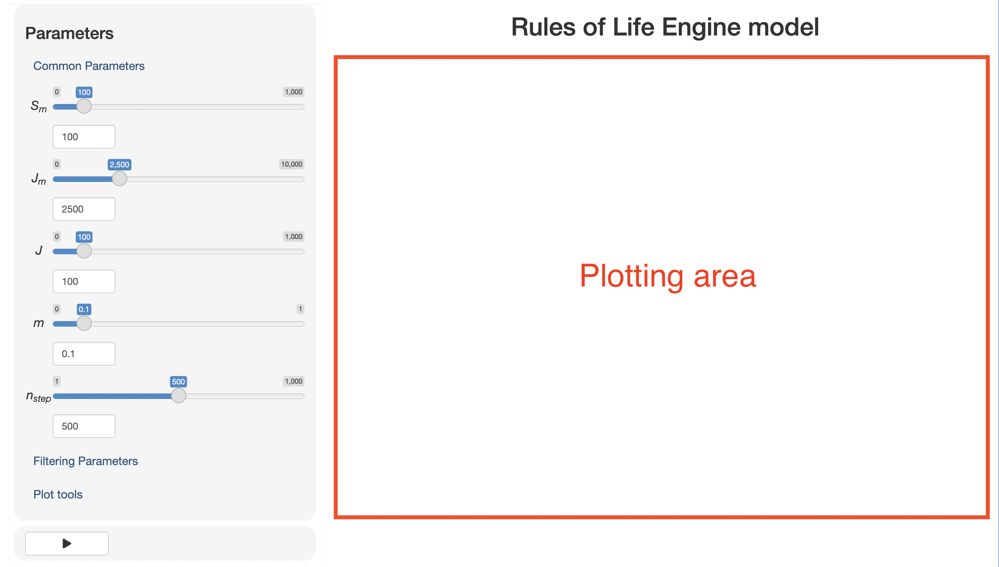

```{r setup, include = FALSE}
knitr::opts_chunk$set(
  collapse = TRUE,
  comment = "#>"
)
```

## What is roleShiny?

Blurb about what this app is for, what the Role model is, etc.

## Quick Start

The app is divided into two main sections. On the left are your input parameters, plotting controls, and download buttons. On the right is the area for your plots.


{width="70%"}

The plotting area should be blank until you're ready to plot your simulation output.

Below the input sliders, there should be a "play" button. Go ahead and click this button to run a quick neutral simulation. In the bottom right you should see a progress bar that hopefully opens and disappears quickly. When the progress bar disappears, your simulation is done!

Distribution plots are animated, where you can see the abundance or trait distributions change over time! All plots are interactive, although I haven't provided super useful scroll-over text yet. To download a screenshot of the plot, click the camera icon in the top left corner of the plot.

You may notice the `Plot tools` tab. Ignore this- we're going to flesh these tools out later. The current slider lets you decide how many time steps to plot in the Distribution plots.

## Neutral simulations

The parameters under the `Common parameters` tab are used for all categories of community assembly. Without additional parameters, they result in neutral models of community assembly. The default values are small simulations that may or may not reach equilibrium (i.e., the abundance and trait distributions reach a steady state, which you can observe in the time series plots as the abundance and trait values oscillating around a central value).

The parameters are defined as:

-   `Sm`- Number of species in the metacommunity
-   `Jm`- Number of individuals in the metacommunity
-   `J` - Number of individuals in the local community
-   `m` - Probability of migration into the local community from the metacommunity
-   `nstep` - The number of time steps (generations) to run

Parameter values can be modified either using the slider tool or by entering an exact value in the text box below each slider.

## Coexistence

Parameters for environmental filtering are found under the `Filtering Parameters` tab that will open up once you click on it.

First, you can decide between two types of environmental filtering, with the default being **None**.

**Stabilizing** filtering involves only allowing individuals with certain trait values to be allowed to enter and reproduce in the local community. The `M` parameter controls the mean of this trait, while the `SD` parameter controls the standard deviation around this trait. Note- this type of filtering takes a while to compute. You may have to wait up to a few minutes depending on the number of individuals and species you are simulating.

**Disruptive** filtering involves only allowing species with traits that are contrasted (i.e. away from the middle value) to exist in the community. No parameters are needed to specify this- the `M` and `SD` sliders will be ignored.

## Downloading simulation output

If you would like, you can download an RDS object with the `download simulation RDS object` button. This is useful if you would like to work with the `ecolottery` model object in R for more freedom in exploring the model output. Note- you need the `ecolottery` package installed to work with this object.

Also, you can download a zip file containing spreadsheets of model output and input parameters using the `download simulation CSVs` button. Unzip the folder on your machine and you will have access to CSV files of local traits, local abundances, metacommunity traits, metacommmunity abundances, and input parameter values. You can then explore these files in R, Excel, Python, or any software that works with CSV files.

## Resources

